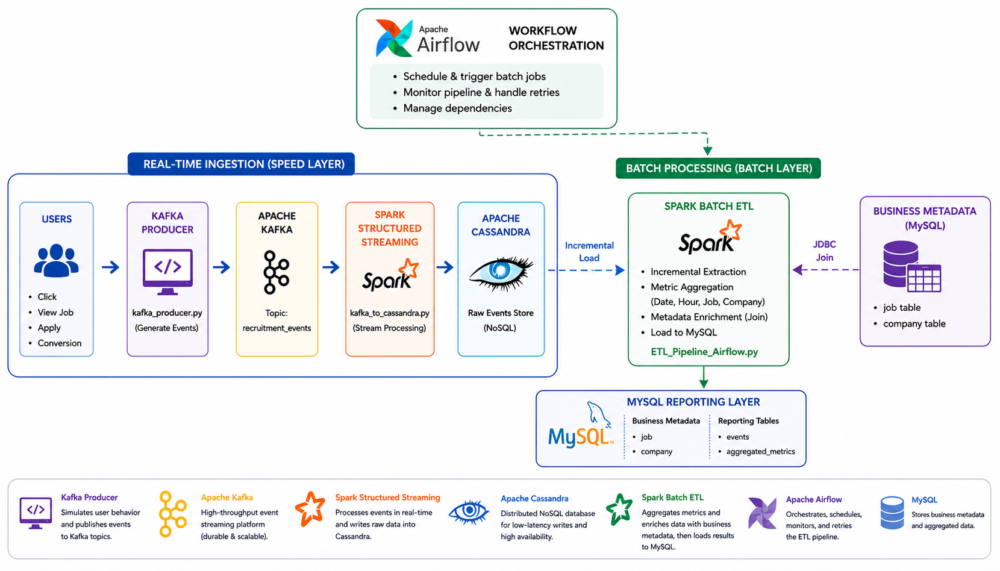
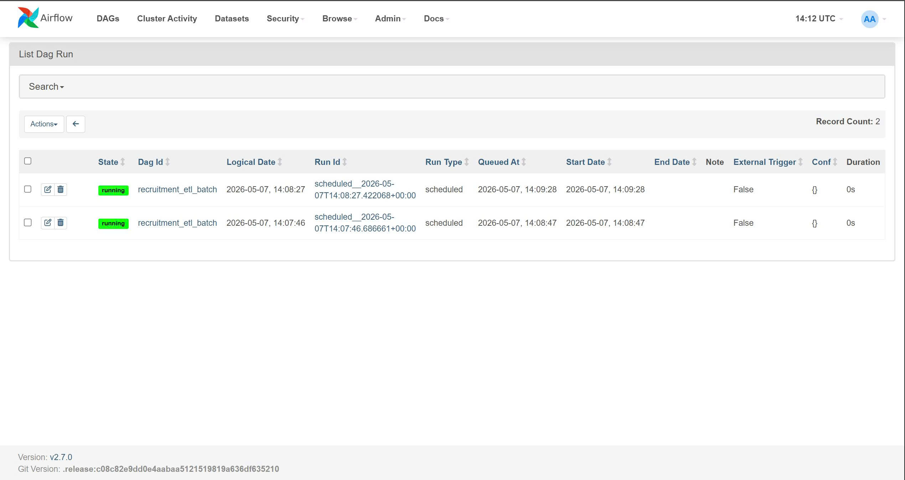

# Recruitment Data Platform: Real-time & Batch ETL Pipeline

## 📌 Problem Statement
In the competitive recruitment industry, tracking user interactions (clicks, conversions, applications) in real-time is crucial for optimizing job placements. However, raw interaction data is high-volume and fragmented. Recruiters need a system that can:
- Capture millions of "tracking events" as they happen.
- Aggregate these events into meaningful business metrics (e.g., spend per hour, conversion rates).
- Enrich raw events with job/company metadata for comprehensive reporting.

## 🚀 The Solution
This project implements a hybrid **Lambda-style Architecture** to process recruitment data. It uses **Kafka** and **Spark Streaming** for real-time ingestion into **Cassandra**, followed by an **Airflow-orchestrated Batch Pipeline** that aggregates and synchronizes data into **MySQL**. This provides a unified "Recruitment 360" view for analytical reporting.

---

## 1. Overall Pipeline Flow

> **Figure 1**: This diagram illustrates the hybrid Lambda-style architecture of the project. It starts with user interactions being captured as events in **Kafka**, processed in real-time via **Spark Streaming** into **Cassandra**, and finally aggregated into **MySQL** via an orchestrated **Airflow** batch process.

The system is designed as a robust data factory consisting of three main stages:

1.  **Data Ingestion**: A **Kafka Producer** simulates live user events, which are then captured by **Spark Structured Streaming**.
2.  **Real-time Storage**: Processed streams are immediately persisted into **Apache Cassandra**, ensuring no data loss and high write availability.
3.  **Batch Aggregation & Sync**: **Apache Airflow** schedules periodic Spark jobs to aggregate metrics from Cassandra, join them with business metadata from **MySQL**, and load the final results back into a dedicated reporting table.

## 2. What is Recruitment ETL Analytics?
Recruitment ETL is the process of turning raw "digital footprints" of job seekers into actionable recruitment intelligence. In this project:
- **Event Tracking**: Capturing every click, conversion, and application status.
- **Metric Aggregation**: Calculating total spend, average bids, and success rates per job/publisher.
- **Unified Reporting**: Combining high-volume interaction logs with relational job/company details.

## 3. Detailed Execution Process

### Workflow 1: Real-time Ingestion (Kafka to Cassandra)
- **Data Streaming**: Consuming JSON-formatted events from Kafka topics.
- **Schema Enforcement**: Validating and flattening the nested event data using Spark's `StructType`.
- **Persistent Sink**: Storing raw interaction logs in a distributed Cassandra keyspace for low-latency writes and long-term durability.

### Workflow 2: Batch Processing & Orchestration (Airflow)
- **Incremental Loading**: Using a "High-Watermark" (timestamp) to fetch only new data from Cassandra since the last recorded update in MySQL.
- **Metric Calculation**: Grouping data by *Date, Hour, Job ID, and Publisher* to calculate KPIs like `spend_hour`, `clicks`, and `qualified_application`.
- **Metadata Enrichment**: Performing a Spark JDBC join with MySQL's `job` and `company` tables to attach essential business dimensions.
- **Automated Scheduling**: Managed by **Airflow DAGs** with custom retry policies, monitoring, and defined dependency graphs.

> **Figure 2**: The Airflow Grid View demonstrates the high-frequency orchestration of the ETL pipeline. With a **1-minute schedule interval**, each green square represents a successful batch run that synchronized data from the NoSQL layer (Cassandra) to the Relational layer (MySQL).

## 4. Project Structure & File Descriptions

The project is organized into functional modules for data generation, streaming, batch processing, and orchestration:

### 📁 `scripts/` (Core Processing Logic)
- **[kafka_producer.py](file:///e:/DE_NEXT/Recruitment_Project_Ver2/scripts/kafka_producer.py)**: A synthetic data engine that generates randomized recruitment events (clicks, applications) and publishes them to Kafka topics. It simulates real-world user behavior.
- **[kafka_to_cassandra.py](file:///e:/DE_NEXT/Recruitment_Project_Ver2/scripts/kafka_to_cassandra.py)**: The Real-time Consumer. It uses Spark Structured Streaming to listen to Kafka, parse JSON payloads, and persist the raw data into Cassandra.
- **[ETL_Pipeline_Airflow.py](file:///e:/DE_NEXT/Recruitment_Project_Ver2/scripts/ETL_Pipeline_Airflow.py)**: The Batch Processor. Specifically optimized for Airflow, this script performs incremental data extraction from Cassandra, aggregates metrics, joins with MySQL metadata, and syncs the final results to the reporting table.
- **[ETL_Pipeline.py](file:///e:/DE_NEXT/Recruitment_Project_Ver2/scripts/ETL_Pipeline.py)**: A standalone, continuous synchronization script used for development and local testing without Airflow.

### 📁 `airflow/dags/` (Orchestration)
- **[recruitment_etl_dag.py](file:///e:/DE_NEXT/Recruitment_Project_Ver2/airflow/dags/recruitment_etl_dag.py)**: The Airflow DAG definition. It orchestrates the execution of the batch pipeline, defining the 1-minute schedule interval, retry policies, and task dependencies.

### ⚙️ Configuration & Infrastructure
- **[.env](file:///e:/DE_NEXT/Recruitment_Project_Ver2/.env)**: Centralized environment variables containing database credentials, hostnames, ports, and Spark JAR paths.
- **[docker-compose.yml]**: Orchestrates the multi-container environment (Kafka, Spark, Cassandra, MySQL, and Airflow).

## 5. Data Visualization & Reporting
The final output is structured in the **MySQL `events` table**, which is ready for connection to BI tools like Power BI, Tableau, or Metabase.

### Key Metrics Tracked:
- **Engagement Analysis**: Total clicks vs. impressions to measure job attractiveness.
- **Cost Efficiency**: Analyzing `spend_hour` against `qualified_application` to optimize bidding.
- **Publisher Performance**: Identifying the most effective traffic sources for different job categories.
- **Trend Spotting**: Monitoring hourly/daily activity shifts to improve ad scheduling.

## 6. Tech Stack
- **Messaging Queue**: Apache Kafka
- **Stream/Batch Processing**: Apache Spark (PySpark)
- **NoSQL Database**: Apache Cassandra (High-volume Event Store)
- **Relational Database**: MySQL (Business Metadata & Reporting Sink)
- **Orchestration**: Apache Airflow
- **Environment**: Docker & Docker Compose

---
*Developed as a high-fidelity Data Engineering solution for recruitment interaction analytics.*
